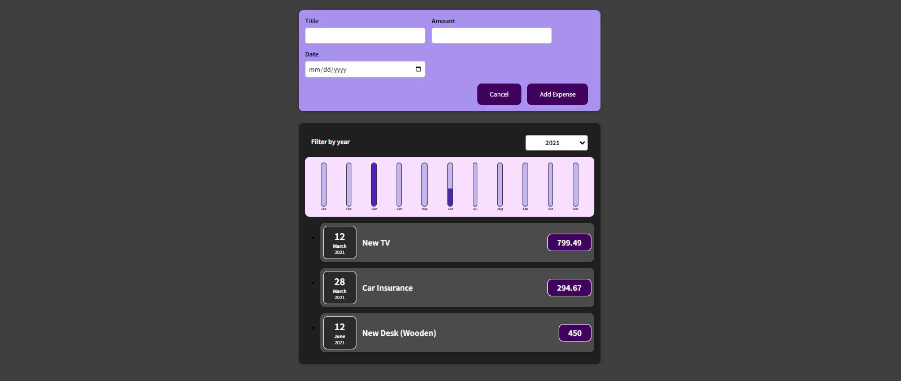

# Getting Started with Expence Tracker

## Install app
/Execute from project root directory/

Install project dependencies:
```
npm install
```
## Start app
Start the app:
```
npm start
```
Open in browser:
```
http://localhost:3000/
---

Expence Tracker is an app where you can add new expences, filter them by year and see all expences for the selected year. 



* Use React JS
* Use HTML
* Use CSS


